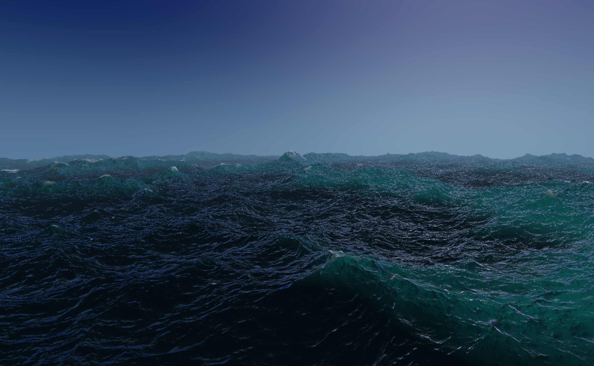

# Three.js Awesome Graphics Agent Skills

This is a Three.js agent skill pack for producing awesome graphics.

It includes mesh design, lighting, PBR materials, textures, shaders, TSL/WebGPU, GLSL, post-processing, realism, stylization, particles, procedural visuals, color management, tone mapping, etc. Graphics excellence is the **main focus** of this skill pack, with sophisticated design aesthetics, philosophy, ergonomics, sensibility, taste. It brings the sophistication of good graphics and eliminates cheap effort.

This is NOT a three.js API cheat sheet, it skips basic 3D production fundamentals and concepts (any decent LLM already has that internal knowledge) as well as three.js API technicalities (just look up docs or use existing API oriented agent skills). Fundamentally, you cannot just provide a summary of what good graphics are like and expect the agent to produce it. The agent needs to see the exact implementation. That's what this skill pack aims to provide, the **vocabulary** of good and sophisticated graphics implementation. It's a skill pack with an attached example library to teach the agent not just what to do but also exactly how to do it.

This skill pack will be continuously updated as more three.js projects with awesome graphics emerge. I hope this skill pack can help anyone build awesome scenes and games with out-of-the-box sophisticated graphics, so you can focus on things like game logic and story.


***A realistic ocean such as this would have taken hours if not days to create and finetune, now it's out of the box***

## Operating model

Load `$threejs-skill-router` for a broad visual task, then load only the atomic systems the work actually needs.

Every graphics system is expected to expose:

- deterministic or reproducible inputs;
- named controlling fields and perceptual parameters;
- diagnostic outputs;
- scale, distance, and temporal stability rules;
- an intentional mechanism-backed quality or resolution tier when the system defines one;
- a no-post baseline that still reads.

## Skills

| Skill | Expertise |
| --- | --- |
| `threejs-skill-router` | Decompose a visual target into the smallest relevant expert systems. |
| `threejs-camera-direction` | Authored lenses and shots, chase/side/orbit rigs, body-relative frames, handoffs, pointer look, floating origins. |
| `threejs-procedural-animation` | Analytic timelines, gravity turns, staging, rotating-frame docking, springs, quaternion alignment, debris motion. |
| `threejs-procedural-fields` | Shared scalar/vector fields, frequency bands, domain warping, causal masks, procedural normals. |
| `threejs-procedural-materials` | Atlas filtering, specular AA, planetary materials, terrain wetness, frame PBR, per-instance dissolve. |
| `threejs-procedural-geometry` | Sculpted frame rails, branch rings, semantic mesh writers, UV density, material groups. |
| `threejs-procedural-vegetation` | Growth hierarchies, branch-ring geometry, stratified children, foliage normals, wind. |
| `threejs-procedural-architecture` | Massing and façade grammars, exposed-edge analysis, modules, material-slot compilation. |
| `threejs-procedural-planets` | Spherical terrain, ridges, craters, biomes, procedural normals, altitude filtering. |
| `threejs-spectral-ocean` | Validated FFT synthesis, spectral cascades, choppy derivatives, Jacobian foam, ocean shading. |
| `threejs-water-optics` | Shared analytic waves/normals, heuristic refraction, fallback absorption, reflection, crest foam. |
| `threejs-atmosphere-aerial-perspective` | Shared Rayleigh/Mie atmosphere, sky, shell/post handoff, depth-based scattering. |
| `threejs-volumetric-clouds` | Weather-shaped density, bounded raymarching, cloud lighting, history, cloud shadows. |
| `threejs-raymarched-space-effects` | Curved-ray integration, black holes, accretion disks, wormholes, bounded quality. |
| `threejs-procedural-vfx` | Reentry shells/wakes, instanced sparks, dissolving debris, dense pools, HDR hierarchy. |
| `threejs-temporal-surfaces` | Persistent touch history, reduced blur, frost composite, and normal refraction. |
| `threejs-shadow-systems` | Stable cascades and cached clipmap shadows with update budgets and invalidation. |
| `threejs-screen-space-ambient-occlusion` | GTAO-style horizon sampling, bent normals, bilateral and temporal reconstruction. |
| `threejs-bloom` | HDR extraction, multi-scale filtering, selective contribution, exposure coupling. |
| `threejs-exposure-color-grading` | Encoded luminance metering, asymmetric adaptation, tone mapping, generated 3D LUT. |
| `threejs-image-pipeline` | Shared render-signal ownership and ordering across multiple image-space systems. |
| `threejs-visual-validation` | Fixed-view captures, diagnostic mosaics, seed/scale sweeps, temporal and GPU evidence. |

## Examples of use

```text
Use $threejs-skill-router to decompose and build a procedural ocean planet
with a ground-to-orbit camera.
```

```text
Use $threejs-procedural-vegetation to build a deterministic tree species
with coherent branching, bark scale, foliage normals, and hierarchical wind.
```

```text
Use $threejs-camera-direction and $threejs-procedural-animation to stage a
planet-relative ship approach with an authored side-camera handoff and docking.
```

```text
Use $threejs-bloom to diagnose the HDR signal and tune bloom without making
the glow carry the underlying form.
```

```text
Use $threejs-visual-validation to produce a deterministic evidence set for
this procedural material across camera distance, seeds, motion, and quality tiers.
```

## Install

The published package and installer command are `threejs-awesome-graphics-agent-skills`.

```sh
# User-wide installation
npx threejs-awesome-graphics-agent-skills install --agent codex
npx threejs-awesome-graphics-agent-skills install --agent claude-code
npx threejs-awesome-graphics-agent-skills install --agent cursor

# Project installation
npx threejs-awesome-graphics-agent-skills install --agent github-copilot --scope project

# Any custom-built agent
npx threejs-awesome-graphics-agent-skills install --agent custom --path ~/.my-agent/skills
```

Supported targets:

| Target | User scope | Project scope |
| --- | --- | --- |
| `universal` | `~/.agents/skills` | `.agents/skills` |
| `codex` | `~/.codex/skills` | `.codex/skills` |
| `claude-code` | `~/.claude/skills` | `.claude/skills` |
| `cursor` | `~/.cursor/skills` | `.cursor/skills` |
| `github-copilot` | `~/.copilot/skills` | `.github/skills` |
| `gemini-cli` | `~/.gemini/skills` | `.gemini/skills` |
| `windsurf` | `~/.codeium/windsurf/skills` | `.windsurf/skills` |
| `custom` | exact `--path` | exact `--path` |

Each installation contains the complete pack so its router can reference every atomic skill. Use `--force` to replace an existing installation and `--dry-run` to inspect changes.

```sh
npx threejs-awesome-graphics-agent-skills uninstall --agent cursor
```

## Development

```sh
npm run validate
npm test
npm run check:freshness
npm pack --dry-run
```

Inspect every included graphics example from one development surface:

```sh
npm run dev:examples
```

The gallery discovers development adapters corresponding to skill examples
automatically and provides single-example and live-overview modes, viewport/DPR
controls, pause/time controls, debug-mode routing, standalone launch, runtime
metrics, and canvas capture. It is repository tooling and is not installed as
an agent skill.

Current accepted inspection surfaces:

- [Atmosphere and aerial perspective](http://127.0.0.1:4173/?example=threejs-atmosphere-aerial-perspective%2Flut-aerial-perspective)
  — precomputed sky radiance, sun transmittance, and depth-aware segment
  scattering;
- [Sculpted gallery frame](http://127.0.0.1:4173/?example=threejs-procedural-geometry%2Fsculpted-gallery-frame)
  — profile-swept mesh, authored frame PBR, grazing lights, shadows, and
  selective bloom;
- [Ash growth system](http://127.0.0.1:4173/?example=threejs-procedural-vegetation%2Fstructured-ash-growth)
  — species-specific hierarchy, branch geometry, foliage, wind, and meadow;
- [Curved-ray accretion volume](http://127.0.0.1:4173/?example=threejs-raymarched-space-effects%2Fcurved-ray-accretion-volume)
  — bounded ray steering, accretion density, transmittance, and bent
  environment lookup;
- [Spectral cascade ocean](http://127.0.0.1:4173/?example=threejs-spectral-ocean%2Fspectral-cascade-ocean)
  — directional spectra, staged inverse FFT, choppy displacement, and
  persistent Jacobian foam;
- [Procedural planet surface](http://127.0.0.1:4173/?example=threejs-procedural-planets%2Fprocedural-planet-surface)
  — coupled displacement, geological fields, biome masks, water, and
  altitude-filtered material detail;
- [Authored financial tower](http://127.0.0.1:4173/?example=threejs-procedural-architecture%2Fauthored-financial-tower)
  — semantic massing, façade grammar, grouped mesh emission, and cached
  clipmap shadows;
- [Analytic wave optics](http://127.0.0.1:4173/?example=threejs-water-optics%2Fanalytic-wave-optics)
  — shared displaced waves and normals, filtered microstructure, Fresnel,
  refraction, absorption, and crest response;
- [Weather volume clouds](http://127.0.0.1:4173/?example=threejs-volumetric-clouds%2Fweather-volume-clouds)
  — packed weather channels, profile-shaped density, bounded integration,
  directional lighting, and temporal reconstruction;
- [Reentry plasma](http://127.0.0.1:4173/?example=threejs-procedural-vfx%2Freentry-plasma)
  — closed layered wake shells, flow deformation, advected filaments, and
  additive thermal emission;
- [Touch-history frost](http://127.0.0.1:4173/?example=threejs-temporal-surfaces%2Ftouch-history-frost)
  — persistent interaction history, static crystalline fields, reduced blur,
  and two-scale refraction.

Generate deterministic captures and a contact sheet:

```sh
npm run capture:examples
```

The gallery contract is documented in
[`dev/example-gallery/README.md`](dev/example-gallery/README.md).
