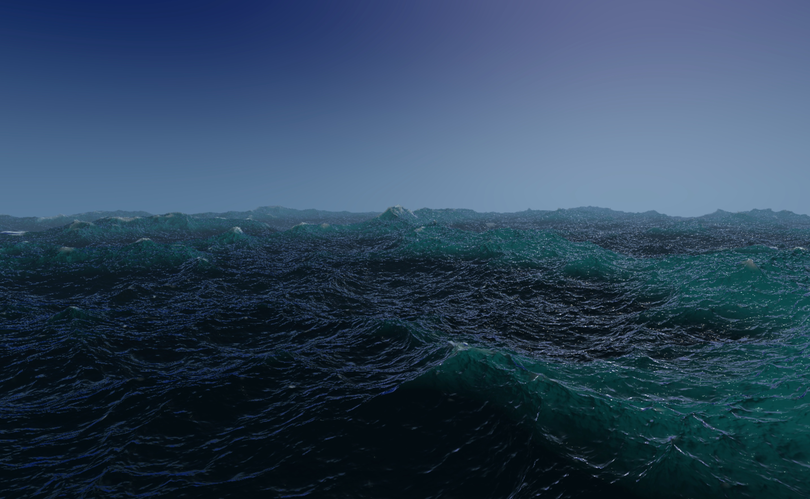

# Three.js Awesome Graphics Agent Skills

[](https://github.com/scottstts/Threejs-Awesome-Graphics-Agent-Skills/stargazers)
[](https://www.npmjs.com/package/threejs-awesome-graphics-agent-skills)
[](https://www.npmjs.com/package/threejs-awesome-graphics-agent-skills)


***Example gallery to visually inspect included examples***

This is a Three.js agent skills pack for producing awesome graphics.

It includes mesh design, lighting, PBR materials, textures, shaders, TSL/WebGPU, GLSL, post-processing, realism, stylization, particles, procedural visuals, color management, tone mapping, etc. Graphics excellence is the **main focus** of this skill pack, with sophisticated design aesthetics, philosophy, ergonomics, sensibility, taste. It brings the sophistication of good graphics and eliminates cheap hacks.

This is NOT a three.js API cheat sheet, it skips basic 3D production fundamentals and concepts (any decent LLM already has that internal knowledge) as well as three.js API technicalities (just look up docs or use existing API oriented agent skills). Fundamentally, you cannot just prompt the agent for "good graphics" and expect the agent to produce it. The agent needs to see the exact implementation of said good graphics. That's what this skill pack aims to provide, the **vocabulary** of sophisticated graphics implementations. It's a skill pack with an attached example library to teach the agent not just what to do but also exactly how to do it.

This skill pack will be continuously updated as more three.js projects with awesome graphics emerge. I hope it can help everyone build awesome scenes and games with out-of-the-box sophisticated graphics, so you can focus on things like game logic and story.


***E.g., A realistic ocean such as this would have taken hours if not days to create and finetune, now it's out of the box***

## Operating model

Every graphics system is expected to expose:

- deterministic or reproducible inputs;
- named controlling fields and perceptual parameters;
- diagnostic outputs;
- scale, distance, and temporal stability rules;
- an intentional mechanism-backed quality or resolution tier when the system defines one;
- a no-post baseline that still reads.

## Skills

| Skill | Expertise |
| --- | --- |
| `threejs-skill-router` | Decompose a visual target into the smallest relevant expert systems. |
| `threejs-camera-direction` | Authored lenses and shots, chase/side/orbit rigs, body-relative frames, handoffs, pointer look, floating origins. |
| `threejs-procedural-animation` | Analytic timelines, gravity turns, staging, rotating-frame docking, springs, quaternion alignment, debris motion. |
| `threejs-procedural-fields` | Shared scalar/vector fields, frequency bands, domain warping, causal masks, procedural normals. |
| `threejs-procedural-materials` | Hybrid texture-backed PBR soil/moss with procedural fields, atlas filtering, specular AA, planetary materials, terrain wetness, lava/emissive surfaces, raytraced diamond/gem refraction, physics-based diffraction grating, dispersive glass transmission, frame PBR, per-instance dissolve. |
| `threejs-parallax-occlusion-mapping` | TSL height marching, clipped flat and curved silhouettes, inflated relief shells, self-shadowing, relief-aware shadow depth. |
| `threejs-procedural-geometry` | Polygon modeling, loft/revolve/sweep/solidify/bevel, crafted assemblies, semantic joins, mesh and scene defect audits. |
| `threejs-procedural-vegetation` | Growth hierarchies, surface-following ivy, stylized and GPU-computed grass, culled procedural flower field, branch-ring geometry, foliage normals, rooted wind. |
| `threejs-procedural-architecture` | Massing and façade grammars, exposed-edge analysis, modules, material-slot compilation. |
| `threejs-procedural-planets` | Spherical terrain, ridges, craters, biomes, procedural normals, altitude filtering. |
| `threejs-spectral-ocean` | Validated FFT synthesis, hybrid FFT/Gerstner water, stylized above/below optics, submerged Snell windows, total internal reflection, aquatic perspective, caustic god rays, spectral cascades, choppy derivatives, Jacobian foam, ocean shading. |
| `threejs-water-optics` | Shared analytic waves/normals, bounded pool heightfields, object ripples, caustics, refraction, absorption, reflection. |
| `threejs-precipitation-surfaces` | Falling snow and rain coupled to accumulation, snow caps, wet puddles, ripple normals, splashes, and shared weather envelopes. |
| `threejs-atmosphere-aerial-perspective` | Shared Rayleigh/Mie atmosphere, sky, shell/post handoff, depth-based scattering. |
| `threejs-volumetric-clouds` | Weather-shaped density, bounded raymarching, cloud lighting, history, cloud shadows. |
| `threejs-raymarched-space-effects` | Curved-ray and null-geodesic integration, black holes, accretion disks, traversable wormhole throats with transported observer frames, footprint-filtered lensed celestial spheres and star fields, bounded quality. |
| `threejs-procedural-vfx` | Finite-footprint raymarched aurora curtains, uniform emissive-volume integration, WebGPU voxel fire and smoke, coupled fluid fields, mesh emitters, SDF collisions, reentry shells/wakes, sparks, dissolving debris, dense pools, HDR hierarchy. |
| `threejs-temporal-surfaces` | Persistent touch history, frost composite, wet-window droplets, background refraction, and blur. |
| `threejs-shadow-systems` | Stable cascades and cached clipmap shadows with update budgets and invalidation. |
| `threejs-screen-space-ambient-occlusion` | GTAO-style horizon sampling, bent normals, bilateral and temporal reconstruction. |
| `threejs-bloom` | HDR extraction, multi-scale filtering, selective contribution, exposure coupling. |
| `threejs-exposure-color-grading` | Encoded luminance metering, asymmetric adaptation, tone mapping, generated 3D LUT. |
| `threejs-image-pipeline` | Shared render-signal ownership and ordering across multiple image-space systems. |
| `threejs-visual-validation` | Fixed-view captures, diagnostic mosaics, seed/scale sweeps, temporal and GPU evidence. |

## Install

```sh
# global installation
npx threejs-awesome-graphics-agent-skills@latest install --agent codex
npx threejs-awesome-graphics-agent-skills@latest install --agent dsh
npx threejs-awesome-graphics-agent-skills@latest install --agent claude-code
npx threejs-awesome-graphics-agent-skills@latest install --agent cursor

# Project installation
npx threejs-awesome-graphics-agent-skills@latest install --agent github-copilot --scope project

# Any custom-built agent
npx threejs-awesome-graphics-agent-skills@latest install --agent custom --path designated-agent-skills-dir

# Force a reinstall of the exact currently installed version
npx threejs-awesome-graphics-agent-skills@latest install --agent gemini-cli --force

# To uninstall it
npx threejs-awesome-graphics-agent-skills uninstall --agent codex
```

Supported targets:

| Target | User scope | Project scope |
| --- | --- | --- |
| `universal` | `~/.agents/skills` | `.agents/skills` |
| `grok` | `~/.grok/skills` | `.grok/skills` |
| `codex` | `~/.codex/skills` | `.codex/skills` |
| `dsh` | `${DSH_HOME:-~/.dsh}/skills` | `.dsh/skills` |
| `claude-code` | `~/.claude/skills` | `.claude/skills` |
| `cursor` | `~/.cursor/skills` | `.cursor/skills` |
| `github-copilot` | `~/.copilot/skills` | `.github/skills` |
| `gemini-cli` | `~/.gemini/skills` | `.gemini/skills` |
| `windsurf` | `~/.codeium/windsurf/skills` | `.windsurf/skills` |
| `custom` | exact `--path` | exact `--path` |

## Development

```sh
npm run validate
npm test
npm run check:freshness
npm pack --dry-run
```

Generate deterministic captures and a contact sheet:

```sh
npm run capture:examples
```

Inspect every included graphics example from one development surface:

```sh
npm run dev:examples
```

The gallery is meant for visual inspection of each example included in the 
skill pack. The skills only include the implementation and assets for the example itself 
respectively, while scene setup, camera rig, supporting implementation, supporting assets are owned 
by the gallery dev shim only.

This split is intentional:

- The agent using this skill only needs the implementation and the assets for the example itself
- The gallery is for viewing purpose, the agent doesn't need to know that scene setup

The gallery contract is documented in
[`dev/example-gallery/README.md`](dev/example-gallery/README.md).
